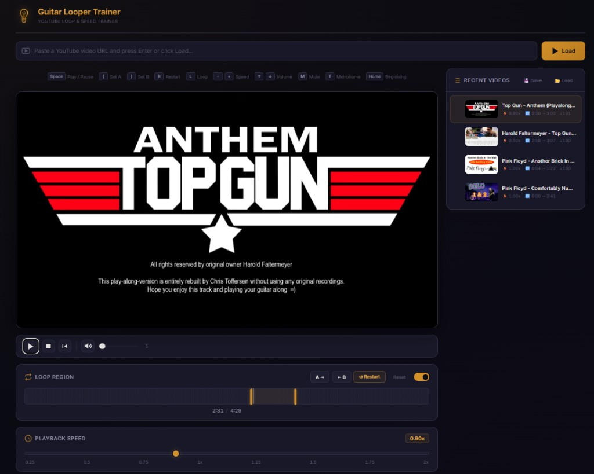
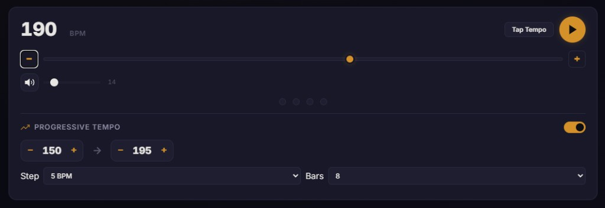

# Guitar Loop Trainer

**Video Loop & Speed Trainer** — A web app for practicing guitar (or any instrument) along with online videos. Set A/B loop regions, slow down playback, use a built-in metronome with progressive tempo, and manage a playlist of practice sessions — all from your browser.


**[Live Demo](https://bonniegrs.github.io/Guitar-Loop-Trainer/)** — try it instantly in your browser, no install needed.

---

### Video Player, Loop Region & Playlist


### Metronome & Progressive Tempo


---

## Features

### Video Playback
- Load any video by pasting a URL or video ID
- Automatic fallback for embed-restricted videos
- Full transport controls: play/pause, stop, seek to beginning

### A/B Looping
- Set loop start (A) and end (B) points from the current playback position
- Drag loop boundaries directly on the visual timeline
- Click anywhere on the timeline to seek
- Toggle looping on/off per video
- Loop settings are saved and restored automatically

### Speed Control
- Adjust playback speed from **0.25x** to **2.0x** in **0.05** increments
- Quick-access preset buttons for common speeds
- Live speed badge indicator

### Metronome
- Web Audio-based click track with accented downbeat (4/4 time)
- BPM range: 30–300
- **Tap tempo** — tap a button to detect BPM from your rhythm
- Visual beat indicator dots
- Independent volume control

### Progressive Tempo
- Set a start BPM, end BPM, step size, and number of bars
- The metronome automatically increases tempo after each set of bars
- Visual progress bar and toast notifications on tempo changes
- Great for gradually building up speed on difficult passages

### Playlist & Session Management
- Recent videos sidebar with thumbnails and metadata
- Per-video persistence of loop points, speed, volume, BPM, and metronome settings
- Drag-and-drop reordering
- **Export** your playlist to a JSON file
- **Import** a playlist from JSON
- Auto-loads a bundled `data/playlist.json` on first visit (if no saved data exists)
- Stores up to 50 entries in `localStorage`

### Keyboard Shortcuts

| Key | Action |
|-----|--------|
| `Space` | Play / Pause |
| `[` | Set loop start (A) |
| `]` | Set loop end (B) |
| `R` | Restart from loop start |
| `L` | Toggle loop on/off |
| `-` | Decrease speed |
| `+` / `=` | Increase speed |
| `↑` / `↓` | Volume up / down |
| `M` | Mute / Unmute |
| `T` | Toggle metronome |
| `Home` | Seek to beginning of video |

---

## Getting Started

### Prerequisites

- A modern web browser (Chrome, Edge, Firefox, Safari)
- **Node.js** (optional, for the built-in static server via `npx`)

### Run the App

**Option 1 — Windows quick start:**

Double-click `scripts/start.bat`. It launches a local server on port 3000 and opens the app in your default browser.

**Option 2 — Any static server:**

```bash
npx serve -l 3000
```

Then open [http://localhost:3000](http://localhost:3000).

**Option 3 — Python:**

```bash
python -m http.server 3000
```

**Option 4 — VS Code Live Server:**

Install the [Live Server](https://marketplace.visualstudio.com/items?itemName=ritwickdey.LiveServer) extension and click "Go Live".

> **Note:** Serving over HTTP is recommended. Opening `index.html` directly as a `file://` URL may cause issues with the embedded video player.

---

## Project Structure

```
Guitar-Loop-Trainer/
├── index.html            # Single-page app shell
├── styles.css            # Full theme and layout
├── favicon.svg           # Guitar-pick tab icon
├── js/
│   ├── app.js            # Entry point — imports modules, wires events, init
│   ├── config.js         # Application-wide constants
│   ├── state.js          # Shared mutable state
│   ├── dom.js            # Cached DOM element references
│   ├── utils.js          # Pure helpers (formatTime, escapeHtml)
│   ├── toast.js          # Toast notification system
│   ├── storage.js        # localStorage persistence layer
│   ├── player.js         # Video player lifecycle and transport
│   ├── loop.js           # A/B loop region and timeline
│   ├── speed.js          # Playback speed control
│   ├── metronome.js      # Web Audio metronome + progressive tempo
│   ├── playlist.js       # Playlist UI, drag-and-drop, import/export
│   └── shortcuts.js      # Keyboard shortcut handler
├── data/
│   └── playlist.json     # Sample playlist (auto-loaded on first visit)
├── scripts/
│   └── start.bat         # Windows launcher script
├── docs/
│   └── TESTING.md        # Testing guide (unit + E2E)
├── tests/                # Unit tests (Vitest)
├── e2e/                  # End-to-end tests (Playwright)
├── screenshots/          # README screenshots
├── package.json          # Dev dependencies and scripts
├── vitest.config.js      # Unit test configuration
├── playwright.config.js  # E2E test configuration
├── .editorconfig         # Editor formatting rules
├── .gitignore
├── LICENSE               # MIT License
└── README.md
```

No build step, no bundler, no framework — vanilla ES modules loaded natively by the browser.

---

## Tech Stack

| Layer | Technology |
|-------|------------|
| UI | Vanilla HTML5 / CSS3 / JavaScript |
| Video | IFrame Player API (embedded video playback) |
| Audio | [Web Audio API](https://developer.mozilla.org/en-US/docs/Web/API/Web_Audio_API) (metronome) |
| Metadata | [noembed.com](https://noembed.com) (video title resolution) |
| Fonts | [Inter](https://fonts.google.com/specimen/Inter) via Google Fonts |
| Persistence | `localStorage` |
| Testing | [Vitest](https://vitest.dev/) + [Playwright](https://playwright.dev/) |

---

## Testing

### Unit Tests (Vitest)

Cover pure logic: URL parsing, time formatting, HTML escaping, localStorage round-trips, speed/BPM clamping, and config constants.

```bash
npm install
npm test
```

### End-to-End Tests (Playwright)

Launch a real browser and verify the full app: page load, UI elements, speed/loop/metronome controls, playlist auto-load, keyboard shortcuts, and responsive layout.

```bash
npx playwright install chromium   # first time only
npm run test:e2e
```

### Run Everything

```bash
npm run test:all
```

For the full testing guide (debugging, watch mode, adding new tests), see [TESTING.md](docs/TESTING.md).

---

## Disclaimer

This application embeds third-party video content. All video and audio materials are the property of their original creators and copyright holders. This tool does not host, download, or redistribute any media content.

## License

This project is licensed under the [MIT License](LICENSE).

Copyright (c) 2026 [@bonniegrs](https://github.com/bonniegrs)
